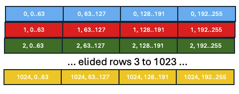
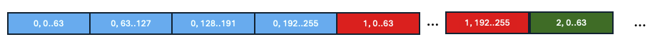
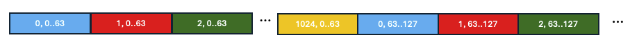

# Tiled Tensors

**Authors:**
* @dgrove-oss
* @tardieu

## **Summary**

PyTorch tensors have a `size()` that describes their logical dimensionality.
When a tensor is realized, its elements must be laid out in some specific linerar order
in memory. In PyTorch, the `strides()` of a tensor encode this linear ordering by specifiying
for each dimension of the tensor the distance between consecutive elements of the dimension.
Commonly used linearizations including row major (dimension `-1` has stride `1`) and
column major (dimension `0` has stride `1`) can be naturally represented using `strides()`.
However `strides()` by itself cannot properly represent *tiled* tensors, which break the invariant
that the stride between every consecutive element in a dimension can be described by a single integer.
The goal of this RFC is to motivate the need for enabling a tiled memory layout as a first-class concept
in PyTorch and to extend PyTorch's APIs and implementation to naturally support them.

## **Motivation**

### Background: Sticks and Tiles

Like many AI accelerators, IBM's Spyre is a SIMD engine. Most memory and compute
operations operate on fixed-sized chunks. On Spyre, we call this chunk of 128
bytes a _stick_. The importance of tiling for efficient computation is familiar
from GPUs but even more important for dataflow accelerators built around
systolic arrays like Spyre. Tensors are processed in fixed-sized _tiles_
matching the array dimensions.

#### Contiguous Tiles

The optimal in-memory format of tensors on an accelerator depends on the
specifics of the memory subsystems and compute capabilities of the device.
Balancing accesses across memory banks, minimizing cache conflicts in set
associative caches, alignment constraints may all contribute to preferring one
layout over another. Spyre's optimal memory bandwidth is achieved when
transferring contiguous sticks in bulk. Tensors are therefore laid out in a
tiled fashion. Sticks belonging to the same tile are stored contiguously in
memory. As a consequence, sticks that are consecutive from the perspective of
PyTorch-level indexing may not actually be consecutive on the device.

As a simple concrete example of a tiled tensor, consider a 2-D row-major float16
tensor with a size of `(1024, 256)`. Each stick contains 64 2-byte float16
values; therefore the 256 elements of each row form exactly 4 sticks. The
picture below shows a logical view of this tensor, highlighting how the rows are
divided into sticks.



In a standard row-major memory layout, the sticks of the tensor would be
linearized in memory as shown in the picture below. This is represented in
PyTorch with strides `(256, 1)`.



In contrast, Spyre tiles the sticks of the tensor so that they are linearized in
device memory as depicted in the picture below:



In effect, the 2-D tensor of size `(1024, 256)` is laid out in device memory as
if it were a 3-D tensor of size `(4, 1024, 64)` with strides `(65536, 64, 1)`.
Each row of the PyTorch tensor is broken into 4 non-consecutive sticks which now
form the outermost dimension of the 3-D tensor. As a benefit, the tensor on the
device is conveniently laid out into contiguous `(N, 64)` tiles with `1 <= N <=
1024` matching the width of the systolic array.

Generalizing to N dimensions with k tiling dimensions, the mapping between host
and device layouts can be represented as 3 tuples of N+k integers corresponding
to the loop ranges, host strides, and device strides of an N+k loop nest. By
convention we order the elements of the three tuples in decreasing device stride
order. Using this notation, the concrete example above would have the
specification: `((4, 1024, 64), (65536, 64, 1), (64, 256, 1))` which corresponds
to the loop nest below:

```
for i in range(4):
  for j in range(1024):
    for k in range(64):
      device_memory[device_tensor_address + i*65536 + j*64 + k*1] = host_memory[host_tensor_address + j*256 + (i*64 + k*1)]
```

#### Padded Tensors

Memory subsystems, SIMD or tiling constraints may result in padding
requirements. Spyre memory accesses are 128-byte aligned typically requiring the
innermost dimension (called _stick dimension_) of a tensor to be padded to the
next multiple of 128 bytes. Concretely a float16 tensor with size `(1000, 200)`
will be laid out on the device as a 3-D tensor with size `(4, 1000, 64)` so that
each row of the PyTorch tensor becomes 4 sticks with the last stick of each row
only comprising the last 8 elements of the row.

Tensors in host memory are typically not padded or not padded as much, so the
mapping between host and device memory layouts described above is extended to
account for padding requirements.

#### Operational Constraints

Accelerators may impose a number of constraints on the input and output memory
layouts of their operations. Spyre for example requires for optimal performance
that the two inputs of a dot product have identical memory layout.

Operations producing smaller or larger output relative to input sizes may
consume or produce sparse tensors. When reductions operations are performed
along the stick dimension, Spyre’s SIMD engine produces results that only
contain a single element per stick. For a float16 tensor, the stride of the
output stick dimension is 64.

### Implications of Device Tensor Layouts for PyTorch

To implement host/device memory transfers and device memory allocation for
accelerators with tiling and/or padding constraints, the runtime representation
of tensors must accurately capture the mapping of elements required to transform
the host memory layout to the device memory layout and vice versa.

For correct compilation and optimization, Inductor needs to accurately model the
device memory layout of tensors. Some key challenges include capturing the
multiple strides of tiled dimensions (impacts loop simplifications), sparse
and/or padded layouts (impacts memory planning and backend code generation).
Inductor has to ensure operands have compatible memory layouts and derive the
memory layouts of computed tensors.

Because layout constraints may be both hard and soft resulting into large search
spaces for device memory layouts, the programming model needs to have hooks that
enable programmers to provide hints or directives to guide or control device
memory layouts for tensors.

## **Proposed Implementation**

### Runtime / Programming Model Support

The torch-spyre plugin implements `SpyreTensorImpl`, a subclass of
`TensorImpl` that contains a `SpyreDeviceLayout` object with encapsulates
the device memory layout information.  In our current implementation,
`SpyreDeviceLayout` stores the device size and strides,
a mapping between host and device dimensions, and padding/stick dimension
information. The 3 tuples mentioned earlier and needed for DMA operations
can be derived from `SpyreDeviceLayout` and the host size and strides stored
in the `TensorImpl`.

This `SpyreDeviceLayout` is initialized whenever a Tensor is
created on the Spyre device (eg. by using `to` to transfer a Tensor to
the device, by allocating a new empty Tensor on the device, etc).

By default, dimension N-1 is designated as the stick dimension (and is
padded as needed to evenly divide into sticks).  The `to` operation is
extended to optionally take a list of stick dimensions to enable the
programmer to override the default stick dimension.  Similarly, Tensor
allocation operations are extended to allow optional explicit
specification of the stick dimension(s) when Tensors are created on
the device (the default is used if no explicit specification is
given). The runtime uses this data to implement Tensor data transfers
to/from the host and Spyre device.  A custom `restickify` operation is
provided that allows the programmer or compiler to explicitly
transform the on-chip memory layout of a Tensor to change the stick
dimension(s). This is an expensive operation, since it involves
creating a new backing storage on the device and reading/writing all
bytes of the Tensor to achieve the required memory layout.

### Dynamo / Inductor Compile Time Support

For both correctness and optimization purposes, the on-device memory
layout of Spyre Tensors must be accurately represented in at least
some layers of Dynamo and Inductor.

The main ideas of our current implementation approach are:

1. We add a subclass of `FixedLayout` called `SpyreFixedLayout` that
adds a `device_layout` field that contains a SpyreDeviceLayout.

2. When a `FakeTensor` is created for a graph input that is
a `SpyreTensorImpl`, we use its `SpyreDeviceLayout` to construct the
corresponding `SpyreFixedLayout` instead of the default `FixedLayout`.

3. Before final code generation from LoopLevelIR, we ensure that
all realized operations have `SpyreFixedLayouts` instead of `FixedLayout`.

In our current prototype, we have accomplished `3` by interposing
fairly  early in Inductor's compilation stages.  In particular, we
* dynamically add a new field to `FakeTensor` instances that holds an
  instance of the `SpyreDeviceLayout` class

* enhance the code that constructs a `FakeTensor` from a `Tensor` to capture
the `SpyreDeviceLayout` and store it in the `FakeTensor`.

* enhance the `FakeTensor` propagation machinery and fake_ops to use the
extended layout information on their inputs to compute the extended
layout information of their outputs.

* use the extended layout information from the fx graph nodes in the
Spyre backend code generation.

We are also evaluating a less invasive alternative implementation
in which device layouts are introduced later in Inductor compilation.
We do this by using the `_pre_fusion_custom_pass` extension point of the `Scheduler`
to do a pass over the topologically sorted SchedulerNodes and replacing the
`FixedLayout` of each `ComputedBuffer` with a `SpyreFixedLayout`. We believe
we should be able to adapt the tiled tensor shape computation which is currently
being done in fake_ops to run over the LoopLevelIR instead.

## **Metrics**
 <!--
What are the main metrics to measure the value of this feature?
-->

TODO

## **Drawbacks**
<!--
Are there any reasons why we should not do this? Here we aim to evaluate risk and check ourselves.

Please consider:
* is it a breaking change?
* Impact on UX
* implementation cost, both in terms of code size and complexity
* integration of this feature with other existing and planned features
-->

TODO

## **Alternatives**
<!--
What other designs have been considered? What is the impact of not doing this?
-->
As described [above](#background-spyre-tensors), the tiled memory layout of an
N-dimensional tensors with k stick dimensions could be encoded as an N+k dimensional
tensor using the existing `size()` and `strides()` APIs. A possible implementation
would be to simply have the compiler rewrite the FX graph to be in this form relatively
early in compilation. We identified several drawbacks of this approach:
* Unclear how to handle "user-visible" tensors such as graph inputs/outputs.
* Unclear semantics for non-Pointwise operations.  For example a matrix multiply
  on a 2-D tensor has a well-understood semantics; the semantics of a matrix multiply
  on a 3-D tensor where dimension 0 and 2 are the tiled dimension 1 are not standard.
* Does not by itself address enforcing the layout constraints of specific compute operations.
  
Similarly, we could defer exposing the tiled memory representation and extra dimensions
until Inductor's final code generation (following a similar pattern to how tiling is
implemented in the Triton backend of Inductor).  This blocks us from effective use of
Inductor for memory planning and cross-core work division because these optimizations need
an accurate view of the on-device representation of tensors to perform their tasks.

## **Prior Art**
<!--
Discuss prior art (both good and bad) in relation to this proposal:
* Does this feature exist in other libraries? What experience has their community had?
* What lessons can be learned from other implementations of this feature?
* Published papers or great posts that discuss this
-->
TODO

## **How we teach this**
<!--
* What names and terminology work best for these concepts and why? How is this idea best presented?
* Would the acceptance of this proposal mean the PyTorch documentation must be re-organized or altered?
* How should this feature be taught to existing PyTorch users?
-->
TODO

## **Unresolved questions**
<!--
* What parts of the design do you expect to resolve through the RFC process before this gets merged?
* What parts of the design do you expect to resolve through the implementation of this feature before stabilization?
* What related issues do you consider out of scope for this RFC that could be addressed in the future independently of the solution that comes out of this RFC?
-->

## Resolution

TBD

### Level of Support
<!--
Choose one of the following:
* 1: Overwhelming positive feedback.
* 2: Positive feedback.
* 3: Majority Acceptance, with conflicting Feedback.
* 4: Acceptance, with Little Feedback.
* 5: Unclear Resolution.
* 6: RFC Rejected.
* 7: RFC Rejected, with Conflicting Feedback.
-->

#### Additional Context

### Next Steps

#### Tracking issue
<!---
<github issue URL>
-->

#### Exceptions
